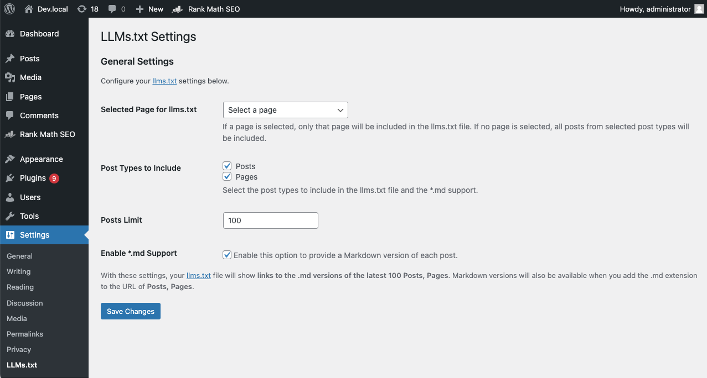
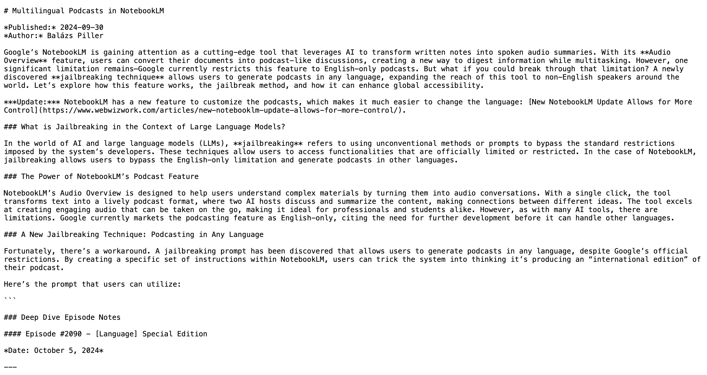

# LLMs.txt for WP

**LLMs.txt for WP** is a WordPress plugin designed to enhance your site’s compatibility with Large Language Models (LLMs) like ChatGPT, Gemini, and Claude. It generates an `llms.txt` file, a standardized Markdown file that aggregates key content in a machine-readable format, making it easier for AI tools to discover and understand your site. Additionally, the plugin supports Markdown versions of posts and pages, accessible by appending `.md` to their URLs.

Inspired by the [llms.txt standard](https://llmstxt.org/), this plugin is ideal for bloggers, businesses, and developers aiming to optimize their content for AI-driven search and discovery. It’s lightweight, secure, and highly customizable, with performance enhancements like caching to ensure efficiency.

## About the `llms.txt` Standard

The `llms.txt` standard provides a machine-readable format for webmasters to specify how their content should be used by Large Language Models (LLMs), similar to `robots.txt` for search engines. By implementing `llms.txt`, you can:

- **Enhance Discoverability**: Help LLMs understand your site’s structure and content.
- **Control Content Usage**: Define permissions for AI training or referencing.
- **Optimize for AI Search**: Improve visibility in AI-driven tools and searches.

Learn more at [llmstxt.org](https://llmstxt.org/).

## Features

- **Generate llms.txt**: Aggregates a specific page or posts from selected post types into a standardized Markdown file for LLMs.
- **Markdown Support**: Enables Markdown versions of posts/pages by appending `.md` to URLs (e.g., `https://example.com/your-post.md`).
- **Customizable Settings**: Choose a single page or multiple post types to include in `llms.txt` via an intuitive admin interface.
- **Post Limit Control**: Set a maximum number of posts to include, ensuring manageable output.
- **Performance Optimized**: Uses transients to cache `llms.txt` content, reducing database queries for faster load times.
- **Secure and Robust**: Includes input sanitization, capability checks, and conflict detection for rewrite rules.
- **Open Source**: Licensed under GPLv2, with contributions welcome on [GitHub](https://github.com/Ahkonsu/wpproatoz-llms-txt-for-wp).

## Installation

1. **Install Dependencies**:
   - Ensure Composer is installed on your server.
   - Navigate to the plugin directory and run `composer install` to install the required `league/html-to-markdown` library (^2.2.7).
2. **Download the Plugin**:
   - Download the plugin ZIP file from the [GitHub releases page](https://github.com/Ahkonsu/wpproatoz-llms-txt-for-wp/releases).
3. **Upload and Install**:
   - In your WordPress admin dashboard, go to **Plugins > Add New > Upload Plugin**.
   - Upload the ZIP file and click **Install Now**.
4. **Activate the Plugin**:
   - Click **Activate Plugin** from the Plugins menu.
5. **Configure Settings**:
   - Go to **Settings > LLMs.txt Settings** in the WordPress admin.
   - Select a specific page or post types to include in `llms.txt`.
   - Set the maximum number of posts and enable Markdown support if desired.
6. **Verify Output**:
   - Visit `https://yourdomain.com/llms.txt` to view the generated file.
   - If Markdown support is enabled, append `.md` to a post/page URL to view its Markdown version.

## Usage

1. **Access Admin Settings**:
   - Navigate to **Settings > LLMs.txt Settings** to configure the plugin.
2. **Customize Content**:
   - **Selected Page for llms.txt**: Choose a single page to include in `llms.txt`, or leave blank to include posts.
   - **Post Types to Include**: Select post types (e.g., posts, pages) for `llms.txt` and Markdown support.
   - **Posts Limit**: Set the maximum number of posts to include (default: 100).
   - **Enable *.md Support**: Toggle to allow Markdown versions of posts/pages via `.md` URLs.
3. **View Outputs**:
   - Access `https://yourdomain.com/llms.txt` to see the aggregated content.
   - Use `.md` URLs (e.g., `https://yourdomain.com/your-post.md`) for Markdown versions of posts.

## Screenshots

1. **Admin Settings Page** - Configure content inclusion and Markdown support.

   

2. **llms.txt Output** - View the generated `llms.txt` file.

   

3. **Markdown Output** - Example of a post converted to Markdown format.

   

## Frequently Asked Questions

### What is an llms.txt file?
An `llms.txt` file is a Markdown file that provides structured content for Large Language Models (LLMs), similar to `robots.txt` for search engines. It enhances your site’s discoverability by AI tools and allows control over content usage. See [llmstxt.org](https://llmstxt.org/) for details.

### How do I access Markdown versions of posts?
Enable Markdown support in **Settings > LLMs.txt Settings**. Then, append `.md` to any post or page URL (e.g., `https://example.com/your-post.md`) to view its Markdown version.

### Can I control which content appears in llms.txt?
Yes! In the settings page, select a specific page or post types and set a maximum post limit to customize the `llms.txt` content.

### How does caching work for llms.txt?
The plugin caches `llms.txt` content in a transient (`llms_txt_cache`) for 1 hour to reduce database queries. The cache is invalidated when settings or relevant posts are updated.

### What if llms.txt or .md URLs return 404 errors?
This may indicate a rewrite rule conflict. Go to **Settings > Permalinks** and click Save Changes. If the issue persists, check for conflicting plugins/themes.

### What if the League\HTMLToMarkdown library is missing?
An admin notice will appear, and Markdown functionality will be disabled. Run `composer install` in the plugin directory to install `league/html-to-markdown` (^2.2.7).

### Does this plugin affect my site’s SEO?
While not directly impacting traditional SEO, it optimizes content for AI-driven search, enhancing visibility in tools like ChatGPT or Perplexity.

### Is the plugin compatible with multisite installations?
The current version is designed for single-site installations. Multisite support may be added in future releases.

### What happens when I uninstall the plugin?
Uninstalling removes the `llms_txt_settings` option, `llms_txt_cache` transient, and any other plugin transients. No physical `llms.txt` file is created, but the plugin checks for and deletes it if present.

## Changelog

### 1.1.0
- Final production-ready release with all security improvements.
- Removed debug logging for production use.
- Fixed cache notice appearing prematurely after settings updates.

### 1.0.8
- Added transient caching for `llms.txt` content to improve performance.
- Implemented cache invalidation on settings and post changes.
- Added admin notice for cache issues.

### 1.0.7
- Added checks for rewrite rule conflicts with other plugins/themes.
- Improved activation/deactivation hooks to detect and notify about rule issues.

### 1.0.6
- Enhanced uninstall process to clean up settings and transients.
- Improved deactivation hook with cleanup actions.
- Fixed invalid callback in `parse_request` hook.

### 1.0.5
- Improved error handling with detailed logging for content generation.
- Added admin notices for invalid settings and rewrite rule issues.
- Enhanced debug mode safety to prevent sensitive information exposure.

### 1.0.4
- Added version check and fallback for `league/html-to-markdown` library.
- Improved security for third-party library usage.

### 1.0.3
- Added capability checks for `llms.txt` and Markdown content generation.
- Improved error handling for public requests.

### 1.0.2
- Improved error handling and input validation for public requests.
- Standardized text domain to `wpproatoz-llms-txt-for-wp`.
- Added deactivation and uninstall hooks for cleanup.

### 1.0.1
- Fixed invalid callback in `template_redirect` hooks.
- Improved settings sanitization for security.

### 1.0.0
- Initial release with `llms.txt` generation and Markdown support.
- Added admin settings page for content customization.

## Contributing

Contributions are welcome! Fork the repository, submit issues, or create pull requests on [GitHub](https://github.com/Ahkonsu/wpproatoz-llms-txt-for-wp).

## License

This plugin is licensed under the [GPLv2 or later](https://www.gnu.org/licenses/gpl-2.0.html).

## Dependencies

- **[league/html-to-markdown](https://github.com/thephpleague/html-to-markdown)**: Version ^2.2.7, used for HTML to Markdown conversion, loaded via Composer.
